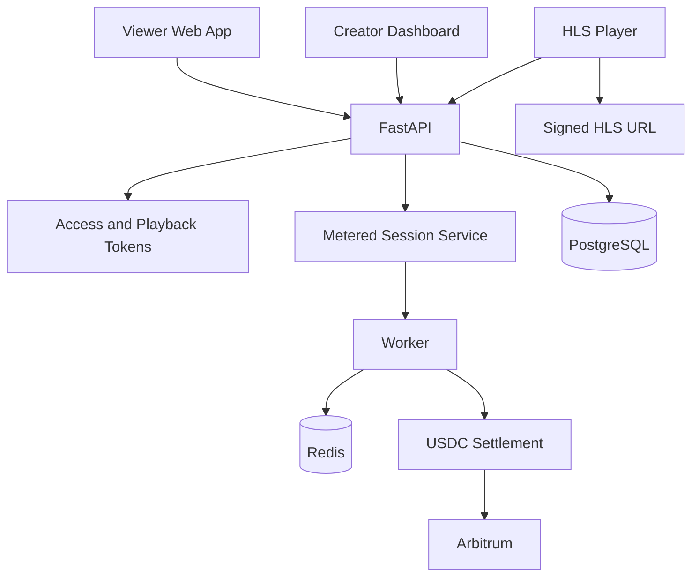

# Subgate Nano — Project Structure

This document describes the focused streaming MVP. For the product overview, see [README.md](./README.md).
For the package migration and implementation sequence, see [PACKAGES-IMPLEMENTATION.md](./PACKAGES-IMPLEMENTATION.md).

## Architecture



## Workspace layout

```text
apps/
  web/       Next.js: viewer discovery, playback, receipts, creator dashboard
  api/       Python FastAPI: catalogue, sessions, payments, playback authorization
  worker/    Heartbeat expiry, metering, settlement, and analytics jobs
packages/
  db/        Legacy TypeScript database layer; removed after Python migration
  streaming/ HLS helpers, playback tokens, heartbeat validation
  payments/  USDC amounts and settlement interfaces
  arbitrum/  Chain configuration and contract clients
  access/    Playback grants and expiry
  pricing/   Pay-per-view and per-minute pricing
  x402/      Payment requirement and verification helpers
  types/     Shared TypeScript contracts
contracts/
  src/       Stream registry and viewing-receipt contracts
  test/      Contract tests
  script/    Deployment scripts
```

## Core flows

### Pay per view

1. Viewer requests a stream.
2. API returns a USDC payment requirement.
3. Settlement is confirmed on Arbitrum.
4. API creates a playback entitlement and short-lived HLS token.

### Pay as you watch

1. Viewer creates a signed stream session with a maximum spend.
2. The player sends a heartbeat every five seconds while playing.
3. The server validates elapsed time and accrues USDC off-chain.
4. The worker settles at a configured threshold and once more when the session stops.
5. The viewer receives a final receipt; the creator dashboard updates.

The server uses timestamps, heartbeat cadence, playback state, and bounded drift; it never trusts a client-provided position alone. Sessions without a heartbeat for 30 seconds are paused or closed.

## Data model

The application persists creators, streams, viewing sessions, playback/access grants, payments, and fee-ledger records. A stream stores its type (`video` or `livestream`), playback reference, pricing model, fixed price or per-minute rate, free-preview duration, and publication status. A session stores validated seconds, accrued/settled USDC, heartbeat time, and its lifecycle state.

## Environment

```env
DATABASE_URL=
SUBGATE_DB_SCHEMA=subgate_nano
FRONTEND_URL=http://localhost:3000
CORS_ORIGIN=http://localhost:3000
REDIS_URL=
ARBITRUM_RPC_URL=
ARBITRUM_CHAIN_ID=421614
USDC_ADDRESS=
PLAYBACK_TOKEN_SECRET=
STREAMING_HEARTBEAT_INTERVAL_SECONDS=5
STREAMING_SESSION_TIMEOUT_SECONDS=30
STREAMING_SETTLEMENT_THRESHOLD_USDC=0.10
SUBGATE_SETTLEMENT_MODE=local
X402_FACILITATOR_URL=https://gateway-api-testnet.circle.com
X402_NETWORK=eip155:421614
X402_ASSET=
X402_GATEWAY_WALLET_ADDRESS=
CREATOR_AUTH_CHALLENGE_TTL_SECONDS=300
CREATOR_SESSION_TTL_SECONDS=604800
ADMIN_EMAIL=admin@example.com
ADMIN_USERNAME=admin
ADMIN_PASSWORD=change-this-in-development
```

The API uses `uv` exclusively. From `apps/api`, run:

```powershell
cd apps/api
uv run uvicorn app.main:app --reload
```

The `app.main` compatibility entry point loads the implementation from
`src/subgate_api`; Uvicorn serves it at `127.0.0.1:8000` by default. From the
repository root, the equivalent shortcut is `pnpm dev:api`.

## Local development and testing

The commands below assume PowerShell on Windows and a local PostgreSQL database
whose connection string is configured in `apps/api/.env`.

### Install and configure

```powershell
# From the repository root
pnpm install

# Sync the Python API environment
cd apps/api
uv sync --dev
cd ../..

# Create local environment files if they do not exist yet
if (!(Test-Path apps/api/.env)) { Copy-Item apps/api/.env.example apps/api/.env }
if (!(Test-Path apps/web/.env)) { Copy-Item apps/web/.env.example apps/web/.env }
```

Set real local values for `DATABASE_URL`, `JWT_SECRET`, and
`INTERNAL_SERVICE_SECRET` in `apps/api/.env`. Keep
`NEXT_PUBLIC_API_URL=http://127.0.0.1:8000` in `apps/web/.env` unless the API
is running on another port.

### Prepare the database

The direct virtual-environment command is the most predictable migration path:

```powershell
cd apps/api
.\.venv\Scripts\python.exe -m alembic -c alembic.ini upgrade head

# Seed the administrator configured in apps/api/.env (required for /admin)
.\.venv\Scripts\python.exe src/subgate_api/seed.py
cd ../..
```

From the repository root, the equivalent shortcuts are:

```powershell
pnpm db:migrate
pnpm db:seed       # optional
```

### Start the local services

Use separate terminals so the API and web logs stay easy to follow.

```powershell
# Terminal 1: FastAPI on http://localhost:8000
cd apps/api
uv run uvicorn app.main:app --reload
```

```powershell
# From the repository root: Next.js on http://localhost:3000
pnpm --filter @subgate/web dev
```

The API health check and web shell can be verified without opening a browser:

```powershell
Invoke-RestMethod http://localhost:8000/health
Invoke-WebRequest http://localhost:3000 -UseBasicParsing
```

Then open `http://localhost:3000` and exercise the main flows:

1. Open **Explore streams** and confirm the public stream directory loads.
2. Open `/creator/register` to create a creator account. Wallet linking is optional during registration.
3. Sign in at `/creator/login`, connect a wallet if you want to publish streams, then create one from `/dashboard/streams/new`.
4. Seed an administrator and open `/admin/login` to review the protected operations desk.
5. Open a public stream URL, start a viewing session, and confirm its receipt state.

### Run automated checks

```powershell
# Python API tests
cd apps/api
.\.venv\Scripts\python.exe -m pytest
cd ../..

# Web typecheck and production build
pnpm --filter @subgate/web typecheck
pnpm --filter @subgate/web build

# Workspace-wide checks (when all workspace packages are configured)
pnpm typecheck
pnpm build
```

For a broader local smoke checklist, first replace all placeholder values in
the environment files, then run:

```powershell
pnpm smoke:local
```

This also checks the worker, sidecar, and Telegram package smoke commands, so
it is intentionally broader than the API and web checks above.

## Database migrations

FastAPI owns the database. SQLAlchemy models live in `apps/api/src/subgate_api/models`, repositories live in `apps/api/src/subgate_api/repositories`, and Alembic revisions live in `apps/api/alembic/versions`. PostgreSQL migrations and API connections use the isolated `SUBGATE_DB_SCHEMA` schema (default `subgate_nano`) so an older public schema can remain intact during the migration.

```bash
# From apps/api in PowerShell
cd apps/api
.\.venv\Scripts\python.exe -m alembic -c alembic.ini revision --autogenerate -m "add streams and viewing sessions"
.\.venv\Scripts\python.exe -m alembic -c alembic.ini upgrade head

# Or from the repository root
pnpm db:migrate
pnpm db:seed
```

Creator authentication supports email/password accounts and an optional EIP-191 wallet signature challenge. Passwords are stored as scrypt hashes; the API stores only one-time challenge records and SHA-256 hashes of opaque creator/admin session tokens. Admin accounts are never publicly registered: set `ADMIN_EMAIL`, `ADMIN_USERNAME`, and `ADMIN_PASSWORD` in `apps/api/.env`, run `pnpm db:seed`, and use `/admin/login`.

The hackathon target is Arbitrum Sepolia; production targets Arbitrum One.

Local development uses the deterministic settlement gateway. Set `SUBGATE_SETTLEMENT_MODE=circle` to require an x402 `PAYMENT-SIGNATURE` and settle through the configured facilitator. Pay-per-view session creation and metered session stopping return `402 Payment Required` with a base64-encoded `PAYMENT-REQUIRED` header until a matching signature is supplied.

## MVP boundaries

Required: creator authentication, wallet connection, stream creation, both pricing models, free preview, HLS playback, signed sessions, heartbeats, metered usage, USDC settlement, receipts, and creator analytics.

Excluded: subscriptions, articles, Telegram, generic API monetization, AI agents, NFTs, chat, social feeds, tipping, creator tokens, and multi-chain support.
