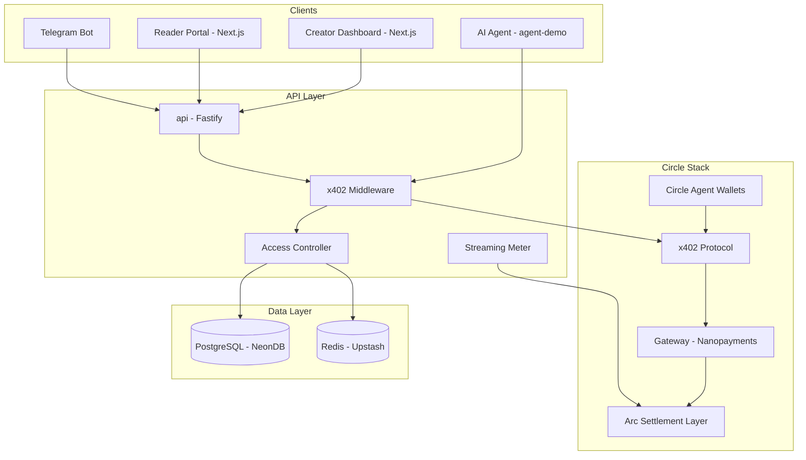
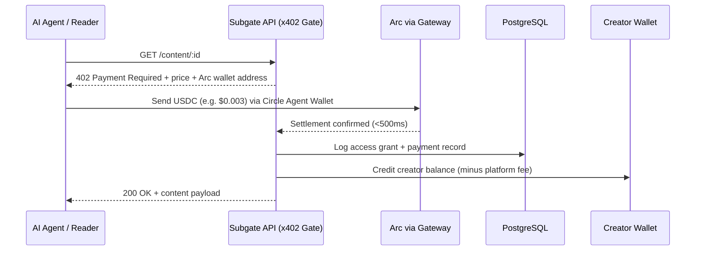
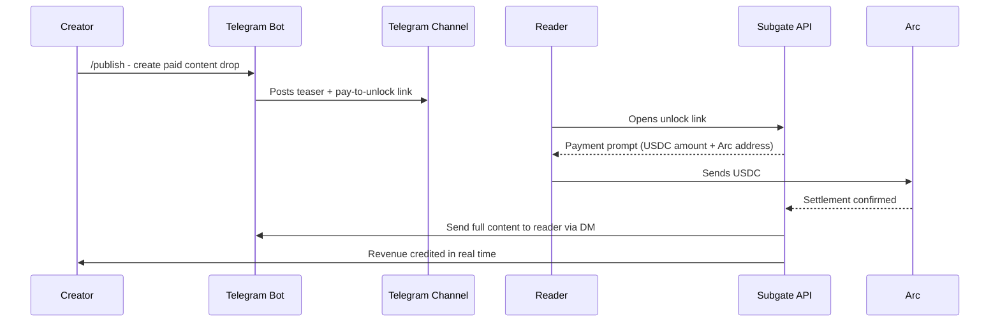
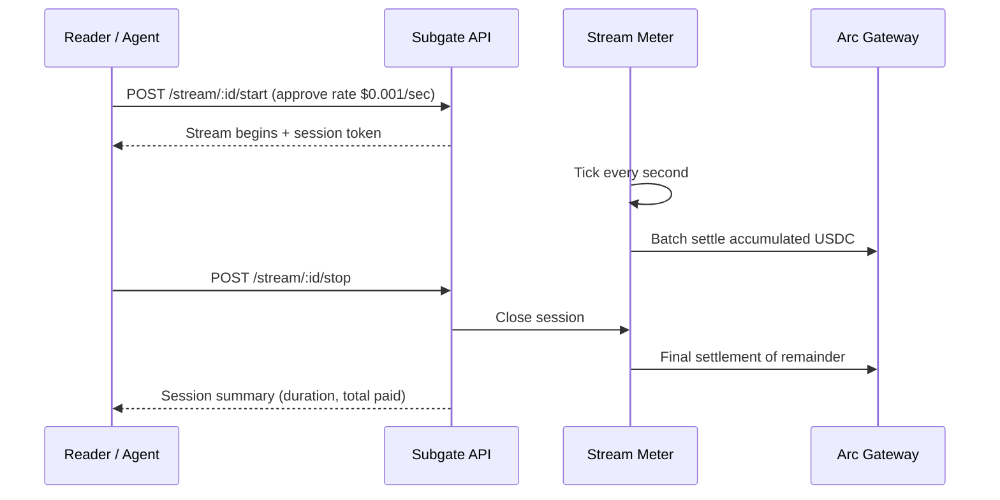
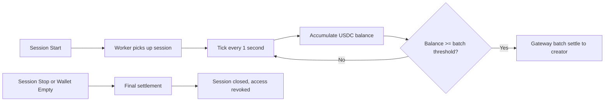
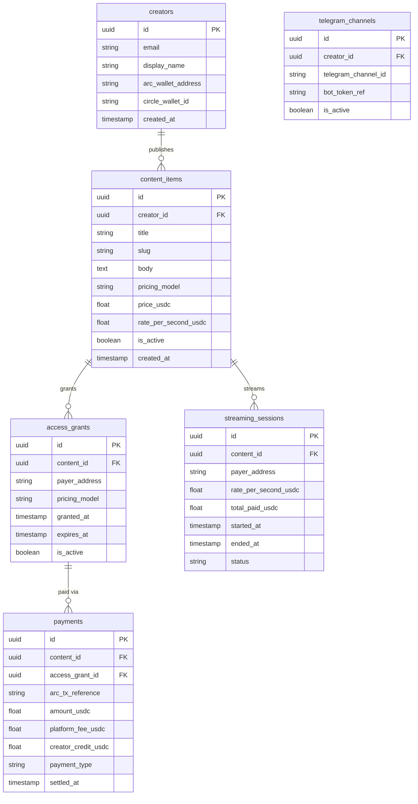

# Subgate Nano

A nanopayment access gateway for creator content and AI agent tools, settled on Arc in USDC.

Subgate Nano lets creators and publishers charge humans and AI agents per access, per API call, per second, or per citation, using x402 over Arc with payments as small as $0.000001, clearing in under 500ms.

Built for the Lepton Agents Hackathon by Canteen x Circle x Arc.

---

## Table of Contents

- [The Problem](#the-problem)
- [What Subgate Nano Does](#what-subgate-nano-does)
- [Architecture](#architecture)
- [Monorepo Structure](#monorepo-structure)
- [Apps](#apps)
- [Packages](#packages)
- [Payment Flows](#payment-flows)
- [x402 Protocol Integration](#x402-protocol-integration)
- [Arc and Circle Stack](#arc-and-circle-stack)
- [Agent Demo](#agent-demo)
- [Streaming Payments](#streaming-payments)
- [Data Models](#data-models)
- [Getting Started](#getting-started)
- [Environment Variables](#environment-variables)
- [Deployment](#deployment)
- [Hackathon RFB Coverage](#hackathon-rfb-coverage)

---

## The Problem

Every subscription is a quiet admission that the real unit was too small to sell on its own.

A creator with a Telegram channel of 4,000 followers cannot charge $0.05 for a single signal post. A publisher cannot charge $0.002 for one article. An AI agent cannot pay $0.0001 to retrieve a single piece of verified data. The payment rails made it uneconomical, so everyone bundled, and the bundle meant most individual pieces of content never got paid for at all.

Arc removes the floor. USDC gas, sub-second finality, and Gateway batching make a $0.000001 payment worth settling. The smallest unit becomes sellable for the first time.

Subgate Nano is the access layer that sits between that rail and the creators, publishers, and agents who need it.

---

## What Subgate Nano Does

**For creators and publishers:**

- Publish gated content, articles, or API endpoints with a per-access price in USDC
- Receive nanopayments instantly on each access, with no monthly subscription overhead
- Distribute paid content links through a Telegram bot with built-in access enforcement
- View real-time revenue, access logs, top payers, and content performance in a dashboard
- Set streaming rates for live content billed per second

**For AI agents:**

- Discover paywalled endpoints that return x402 Payment Required responses
- Autonomously evaluate whether to pay based on a budget and relevance signal
- Pay per article, per API call, or per citation using a Circle-managed agent wallet
- Access the response the moment settlement confirms on Arc

**For readers:**

- Pay once for exactly the content they want, with no forced subscription
- Connect a USDC wallet or use an embedded Circle wallet for frictionless checkout
- Access unlocks instantly after Arc settlement, typically under 500ms

---

## Architecture

### System Overview



### x402 Request Flow



### Telegram Distribution Flow



### Streaming Payment Flow



---

## Monorepo Structure

Subgate Nano uses pnpm workspaces with Turborepo for task orchestration.

```
subgate-nano/
├── apps/
│   ├── web/                  # Creator dashboard and reader portal (Next.js 15)
│   ├── api/                  # x402 gate, access control, and settlement API (Fastify)
│   ├── bot-telegram/         # Telegram bot for content distribution and access enforcement
│   ├── agent-demo/           # Autonomous AI agent that discovers and pays for gated content
│   └── worker/               # Background worker for streaming meters and settlement indexing
├── packages/
│   ├── db/                   # Drizzle ORM schema and migrations (NeonDB)
│   ├── x402/                 # x402 protocol implementation and middleware
│   ├── arc/                  # Arc RPC client and Gateway nanopayment helpers
│   ├── wallets/              # Circle Agent Wallet management
│   ├── pricing/              # Per-access, per-second, and per-citation price engine
│   ├── access/               # Access grant, expiry, and revocation logic
│   ├── ui/                   # Shared React component library
│   └── types/                # Shared TypeScript types and Zod schemas
├── turbo.json
├── pnpm-workspace.yaml
└── package.json
```

---

## Apps

### `apps/web`

The primary user-facing application serving two audiences.

**Creator portal** (`/dashboard`):
- Publish gated content with per-access USDC pricing
- Set streaming rates for live content
- Monitor real-time revenue, access events, and payer analytics
- Connect or generate a Circle-managed creator wallet
- Manage Telegram channel integration for paid content drops

**Reader portal** (`/c/[slug]`):
- Browse a creator's published content catalog
- Pay per piece in USDC via embedded Circle wallet or external wallet
- View access history and active streaming sessions

**Tech stack:** Next.js 15 (App Router), Tailwind CSS, shadcn/ui, React Query, Viem

### `apps/api`

The core backend service. Handles all x402 payment gating, access control, and settlement verification.

Responsibilities:
- Serve x402 402 Payment Required responses with Arc payment details
- Verify Arc settlement via Gateway before granting content access
- Record all access events, payment amounts, and platform fees
- Expose internal endpoints consumed by the Telegram bot and agent demo
- Manage streaming session state and delegate metering to the worker

**Tech stack:** Fastify, Drizzle ORM, NeonDB, Upstash Redis, Circle SDK

### `apps/bot-telegram`

The distribution layer. Makes it trivially easy for a creator to monetize an existing Telegram audience without asking followers to leave the platform.

Capabilities:
- `/publish` command: creator submits content, bot posts a teaser to the channel with a pay-to-unlock link
- `/rate` command: creator sets a per-second streaming rate for a live session
- Access enforcement: bot delivers full content to a reader via DM only after Arc settlement is confirmed
- `/stats` command: creator views revenue and access counts from inside Telegram

### `apps/agent-demo`

A fully autonomous AI agent built on the Circle Agent Stack that browses a Subgate-powered content catalog, decides whether a gated article is worth paying for based on relevance and budget constraints, and settles the payment on Arc using its own Circle-managed USDC wallet.

The agent demonstrates RFB 01 (Autonomous Paying Agents) and RFB 02 (Selling Agent Services via Nanopayments) end to end in a single runnable script.

Capabilities:
- Discover gated content endpoints that return x402 402 responses
- Parse the payment terms from the 402 response header
- Evaluate relevance using an embedded LLM scoring step
- Decide autonomously whether the price is within its per-session budget
- Pay via Circle Agent Wallet and receive the unlocked content
- Log all decisions, payments, and content retrieved in a readable audit trail

**Tech stack:** TypeScript, Circle Agent Stack, Circle CLI, Anthropic SDK (claude-sonnet-4-6)

### `apps/worker`

A long-running background service responsible for:
- Ticking streaming payment meters every second and batching settlement via Arc Gateway
- Indexing Arc transaction confirmations for payment verification
- Triggering access expiry events and notifying the Telegram bot
- Computing platform fee ledger entries on confirmed payments

**Tech stack:** Node.js, BullMQ on Upstash Redis, Circle SDK

---

## Packages

### `packages/x402`

The x402 protocol implementation. Exposes a Fastify middleware that wraps any route behind a payment gate.

```typescript
// Protect any route with a per-access USDC price
app.get('/content/:id', x402Gate({ price: 0.003, currency: 'USDC', chain: 'arc' }), handler);
```

When an unauthenticated request hits a gated route, the middleware returns:

```http
HTTP/1.1 402 Payment Required
X-Payment-Required: {"price":"0.003","currency":"USDC","address":"0x...","chain":"arc"}
```

Once the caller settles on Arc, they include the transaction reference in the next request header. The middleware verifies settlement via Gateway before passing the request to the handler.

### `packages/arc`

Thin wrapper over the Arc RPC and Circle Gateway SDK.

```typescript
interface ArcClient {
  verifySettlement(txRef: string, expectedAmount: number): Promise<boolean>;
  getBalance(address: string): Promise<number>;
  estimateFee(amount: number): Promise<number>;
}
```

Also exposes helpers for the worker's streaming meter to batch nanopayments via Gateway's gasless batching, keeping per-tick settlement costs near zero.

### `packages/wallets`

Circle Agent Wallet management. Handles wallet creation, balance queries, and USDC transfers for both creators and the agent demo.

```typescript
interface WalletManager {
  createWallet(ownerId: string): Promise<Wallet>;
  getBalance(walletId: string): Promise<number>;
  transfer(from: string, to: string, amount: number): Promise<TxResult>;
}
```

### `packages/pricing`

Pricing logic for all access models.

```typescript
type PricingModel =
  | { type: 'per_access'; priceUsdc: number }
  | { type: 'per_second'; rateUsdc: number }
  | { type: 'per_citation'; priceUsdc: number }
  | { type: 'timed'; priceUsdc: number; durationSeconds: number };
```

### `packages/access`

Stateful access grant and revocation. Stores access records in PostgreSQL with TTL-based expiry managed through Redis.

```typescript
interface AccessManager {
  grant(contentId: string, payerId: string, model: PricingModel): Promise<AccessGrant>;
  check(contentId: string, payerId: string): Promise<boolean>;
  revoke(grantId: string): Promise<void>;
}
```

---

## Payment Flows

### Per-Access (Articles, Posts, Files)

The simplest flow. Reader or agent hits the gated endpoint, receives a 402, settles on Arc, and the content is returned in the same response cycle.

Minimum price: $0.000001 via Gateway batching.
Typical article price: $0.001 to $0.01.

### Per-Second (Streams, Live Sessions)

Reader approves a spending rate (e.g. $0.001/sec). The streaming meter in the worker ticks each second and accumulates a running balance. Gateway's gasless batching means the on-chain settlement happens in periodic sweeps, not per tick, keeping fees negligible.

The meter pauses automatically if the reader's wallet balance drops below one tick's worth of USDC.

### Per-Citation (AI Agent Flows)

When an AI agent uses Subgate content as a source in a generated answer, a citation event is emitted. The agent's wallet settles a micro-toll to the original author. The toll is configurable per content item and defaults to $0.0001.

This is demonstrated in the agent demo as an optional second payment after the initial article unlock.

### Timed Access

A fixed price for a defined window (e.g. $0.05 for 24 hours of access to a Telegram channel or Discord server). The worker tracks expiry and revokes access when the window closes.

---

## x402 Protocol Integration

Subgate Nano implements the x402 HTTP payment protocol as defined in the circlefin/arc-nanopayments reference.

Every gated endpoint in `apps/api` is wrapped with the `x402Gate` middleware from `packages/x402`. The middleware handles the full request-payment-verification-response cycle transparently.

Request headers used:

| Header | Direction | Purpose |
|--------|-----------|---------|
| `X-Payment-Required` | Server to client | Price, currency, Arc wallet address |
| `X-Payment-Receipt` | Client to server | Arc transaction reference for verification |
| `X-Payment-Verified` | Server internal | Set by middleware after Gateway confirmation |

The agent demo is the canonical client-side implementation, showing how a paying agent parses the `X-Payment-Required` header, settles via its Circle wallet, and retries the request with `X-Payment-Receipt`.

---

## Arc and Circle Stack

| Component | Usage in Subgate Nano |
|-----------|----------------------|
| Arc L1 | Settlement layer for all USDC payments |
| Gateway / Nanopayments | Gasless batching for per-second and per-citation flows |
| Circle Agent Wallets | Creator wallets and agent demo wallet |
| x402 Protocol | HTTP payment gating on all content endpoints |
| Circle CLI | Local development, wallet management, testnet USDC |
| USDC | Native settlement currency across all flows |

All payments in the hackathon submission use testnet USDC on the Arc testnet. The ARC CLI included in the repo gives judges RPC access to the Canteen-hosted Arc testnet out of the box.

---

## Agent Demo

`apps/agent-demo` is a standalone TypeScript script that can be run against any live Subgate Nano deployment.

### What it does

1. Loads a list of Subgate-gated content endpoints from a seed file or the Subgate API catalog
2. For each endpoint, sends a GET request and parses the 402 response to extract price and payment terms
3. Calls an embedded LLM step (claude-sonnet-4-6) with the content title and description to score relevance against a user-supplied research query
4. If the relevance score exceeds a threshold and the price is within the session budget, the agent pays via its Circle Agent Wallet
5. Receives the unlocked content, optionally emits a citation payment if the content is used in a generated summary
6. Prints a full audit trail: endpoints visited, payments made, content retrieved, total USDC spent

### Running it

```bash
cd apps/agent-demo
cp .env.example .env
# Set CIRCLE_WALLET_ID, SUBGATE_API_URL, and ANTHROPIC_API_KEY

pnpm dev --query "Nigerian monetary policy impact on equities" --budget 0.10
```

### Sample output

```
Subgate Nano Agent Demo
Query: "Nigerian monetary policy impact on equities"
Session budget: $0.1000 USDC

[1/4] GET /content/ngx-mpr-analysis-2024
      402 Payment Required: $0.005 USDC
      Relevance score: 0.91 (threshold: 0.70)
      Decision: PAY
      Settling on Arc... confirmed in 312ms
      Access granted. Content retrieved (2,400 words).
      Citation toll emitted: $0.0001 USDC to creator.

[2/4] GET /content/us-fed-rate-outlook
      402 Payment Required: $0.003 USDC
      Relevance score: 0.34 (threshold: 0.70)
      Decision: SKIP (low relevance)

[3/4] GET /content/dangote-refinery-equity-update
      402 Payment Required: $0.005 USDC
      Relevance score: 0.88 (threshold: 0.70)
      Decision: PAY
      Settling on Arc... confirmed in 289ms
      Access granted. Content retrieved (1,800 words).
      Citation toll emitted: $0.0001 USDC to creator.

Session complete.
Paid: $0.0102 USDC across 2 articles.
Remaining budget: $0.0898 USDC.
```

---

## Streaming Payments

The streaming meter in `apps/worker` implements RFB 04 (Streaming and Continuous Payments).

A streaming session is created when a reader or agent sends `POST /stream/:contentId/start` with an approved rate. The worker picks up the session and begins ticking.



Gateway's gasless batching means the on-chain cost of a 1-second tick is effectively zero until the batch threshold is reached. This makes $0.001/sec streams economically viable at any scale.

---

## Data Models



---

## Getting Started

### Prerequisites

- Node.js 20+
- pnpm 9+
- uv (for ARC CLI)
- PostgreSQL (or NeonDB connection string)
- Redis (or Upstash connection string)
- Circle CLI (`npm install -g @circle-fin/cli`)
- ARC CLI (`uv tool install git+https://github.com/the-canteen-dev/ARC-cli`)

### Installation

```bash
git clone https://github.com/thetruesammyjay/subgate-nano.git
cd subgate-nano
pnpm install
```

### Database Setup

```bash
pnpm --filter @subgate/db generate
pnpm --filter @subgate/db migrate
```

### Arc Testnet Setup

```bash
# Verify ARC CLI is working and connected to Canteen-hosted testnet
arc status

# Create a testnet wallet for the agent demo
circle wallets create --name "subgate-agent-demo"

# Fund it with testnet USDC via TestMint (code: LEPTON26 for free allocation)
# https://testmint.myproceeds.xyz
```

### Development

```bash
# Run all apps in parallel
pnpm dev

# Run individual apps
pnpm --filter @subgate/api dev
pnpm --filter @subgate/web dev
pnpm --filter @subgate/bot-telegram dev
pnpm --filter @subgate/worker dev

# Run the agent demo
pnpm --filter @subgate/agent-demo dev --query "your research query" --budget 0.10
```

### Build

```bash
pnpm build
```

---

## Environment Variables

### `apps/api`

```env
DATABASE_URL=
REDIS_URL=
JWT_SECRET=

CIRCLE_API_KEY=
ARC_RPC_URL=
PLATFORM_FEE_PERCENT=5

BOT_TELEGRAM_INTERNAL_URL=
WORKER_INTERNAL_URL=
INTERNAL_SERVICE_SECRET=
```

### `apps/bot-telegram`

```env
TELEGRAM_BOT_TOKEN=
SUBGATE_API_URL=
INTERNAL_SERVICE_SECRET=
```

### `apps/agent-demo`

```env
CIRCLE_WALLET_ID=
CIRCLE_API_KEY=
SUBGATE_API_URL=
ANTHROPIC_API_KEY=
AGENT_DEFAULT_BUDGET_USDC=0.10
AGENT_RELEVANCE_THRESHOLD=0.70
```

### `apps/worker`

```env
DATABASE_URL=
REDIS_URL=
CIRCLE_API_KEY=
ARC_RPC_URL=
STREAMING_BATCH_THRESHOLD_USDC=0.01
SUBGATE_API_URL=
INTERNAL_SERVICE_SECRET=
```

### `apps/web`

```env
NEXT_PUBLIC_API_URL=
NEXTAUTH_SECRET=
NEXTAUTH_URL=
NEXT_PUBLIC_ARC_CHAIN_ID=
```

---

## Deployment

| App | Platform |
|-----|---------|
| `apps/web` | Vercel |
| `apps/api` | Railway |
| `apps/bot-telegram` | Railway |
| `apps/worker` | Railway |
| Database | NeonDB |
| Redis | Upstash |
| Settlement | Arc (testnet) |

Each `apps/` directory contains a `Dockerfile`. The monorepo root includes a `docker-compose.yml` for local full-stack development.

---

## Hackathon RFB Coverage

| RFB | Title | How Subgate Nano addresses it |
|-----|-------|-------------------------------|
| RFB 01 | Autonomous Paying Agents | `apps/agent-demo`: an agent that discovers x402-gated content, scores relevance, and pays autonomously from a Circle wallet |
| RFB 02 | Selling Agent Services via Nanopayments | Any Subgate-gated API endpoint is an agent-sellable service, priced per call and settled on Arc with no subscription overhead |
| RFB 04 | Streaming and Continuous Payments | `apps/worker` streaming meter: per-second billing with Gateway batch settlement, approved spending rate, and automatic session close on wallet empty |
| RFB 06 | Creator and Publisher Monetization | Core product: creators publish gated content, readers and agents pay per access, Telegram bot distributes to existing audiences, revenue flows to creator wallet in real time |

### Judging criteria alignment

| Criterion | Weight | Subgate Nano approach |
|-----------|--------|-----------------------|
| Agentic Sophistication | 30% | Agent makes autonomous pay/skip decisions using LLM relevance scoring and budget constraints, not a scripted flow |
| Traction | 30% | Telegram bot targets existing Nigerian finance and creator communities with real audiences; testnet payments flow from day one |
| Circle Tool Usage | 20% | x402, Gateway Nanopayments, Circle Agent Wallets, Arc settlement, Circle CLI all used natively |
| Innovation | 20% | Per-citation payment model and LLM-scored autonomous access are novel combinations not in the reference implementations |

---

## License

MIT